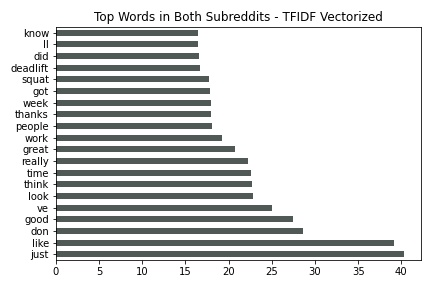

 

# **Web APIs & NLP - Nike Bodybuilding & Powerlifting**
---
## Background ##
---
[Nike](https://www.nike.com/) is the premier brand for all things athletic. From their footwear, apparel, and equipment, Nike has proven itself as a leader in their industry.
Their apps include the following: [Nike](https://www.nike.com/nike-app) (Shoes, Apparel, Stories), [Nike SNKRS](https://www.nike.com/launch) (Sneaker Shopping), [Nike Run Club](https://www.nike.com/nrc-app) (Running Coach), [Nike Training Club](https://www.nike.com/ntc-app) (Fitness). Here's some information on their reviews and release: [Nike Apps R&R](./nike-info/nike-apps-r&r.md). Comparatively, we can see that Nike Training Club isn't doing very well compared to its fellow applications, although it was the earliest of the apps to be released. 

The goal of this project is to bring the Nike Training Club App's engagement and retention up over the next few years by implementing new features/training styles for different types of athletes into the app. By utilizing machine learning algorithms 
and modeling we seek to create the highest accuracy model to be used in user engagement practices. The details below will outline the analyses and approaches that will thoroughly revamp the Nike Training Club App.  

## Problem Statement
---
Nike wants to implement new training styles into their Nike Training Club App to garner more engagement and retention on the app. To start this launch off, we will be implementing [bodybuilding](https://en.wikipedia.org/wiki/Bodybuilding) and [powerlifting](https://en.wikipedia.org/wiki/Powerlifting) programs into the app for new lifters. By utilizing a classification model, we can have users enter a sentence of what their fitness goals are, and with the application returning whether bodybuilding or powerlifting will be more suited for their goals in addition to programs for the corresponding training style. The goal of the classification model is to give the users the most precise program for their fitness goals, ultimately creating more engagement and retention for the app, especially for users looking to implement new styles of training. 
The list of models that will be developed: [CountVectorizer](https://scikit-learn.org/stable/modules/generated/sklearn.feature_extraction.text.CountVectorizer.html), [TfidfVectorizer](https://scikit-learn.org/stable/modules/generated/sklearn.feature_extraction.text.TfidfVectorizer.html), [LogisticRegression](https://scikit-learn.org/stable/modules/generated/sklearn.linear_model.LogisticRegression.html?highlight=logisticregression#sklearn.linear_model.LogisticRegression), [KNeighbors](https://scikit-learn.org/stable/modules/generated/sklearn.neighbors.KNeighborsClassifier.html?highlight=kneighbors#sklearn.neighbors.KNeighborsClassifier.kneighbors), [MultinomialNB](https://scikit-learn.org/stable/modules/generated/sklearn.naive_bayes.MultinomialNB.html?highlight=multinomial#sklearn.naive_bayes.MultinomialNB), and [RandomForest](https://scikit-learn.org/stable/modules/generated/sklearn.ensemble.RandomForestClassifier.html?highlight=randomforest#sklearn.ensemble.RandomForestClassifier).

## Data Dictionary
---
|Feature|Type|Dataset|Description|
|---|---|---|---|
|subreddit|object|bbandpl|subreddit name|
|body|object|bbandpl|subreddit comments|
|comment_character_count|int|bbandpl|count of characters in comments|
|comment_word_count|int|bbandpl|count of words in comments|

## Analysis Summary
---
#### *Data Extraction with Wrangling & Cleaning*
The Reddit comment data was pulled from [bodybuilding subreddit](https://www.reddit.com/r/bodybuilding/) and [powerlifting subreddit](https://www.reddit.com/r/powerlifting/) using [Pushshift's API](https://github.com/pushshift/api) returning 1000 comments each with comments cleansed of AutoModerator author and [removed] comments. Failure in pulling data will return an error: (Error {res.status_code}: {subreddit} doesn't work! Try Again). These comments are then concatenated to a single csv returning the [bbandpl.csv](./dataset/bbandpl.csv) - 2000 rows and 2 columns (subreddit and body).
#### *Exploratory Data Analysis & Data Visualization*
In EDA the dataset was shown to have 2000 rows and 2 columns of object data type with 0 NaN values. Two new columns are created from the body column: 
1. comment_character_count
2. comment_word_count

##### **Utilizing these new columns the following visualizations were created:**
---
##### *From these histograms we can see that both the subreddits have a similar distribution in word/character counts, but the bodybuilding subreddit comments have much higher max values with a some above the scale for powerlifting comments.*

---
##### *From these boxplots we can see the outliers much better in each subreddit comment word and character counts. The bodybuilding subreddit comments have much higher top values.*

---
##### *From these bar charts we see the breakdowns of top words in both subreddits alone and combined.*

*The most notable top words for bodybuilding are:* **bodybuilding, look, good, body, work**

*The most notable top words for powerlifting are:* **squat, bar, deadlift, meet, bench**

#### *Modeling & Accuracy of Models*
---
The baseline for the model is an accuracy of 50% as the dataset is balanced with 1000 comments from [bodybuilding subreddit](https://www.reddit.com/r/bodybuilding/) and 1000 comments from [powerlifting subreddit](https://www.reddit.com/r/powerlifting/). 

Models were built using CountVectorizer and TfidfVectorizer as transformers and LogisticRegression, KNeighbors, MultinomialNB, and RandomForest as estimators. Creating a total of 8 different types of models. The parameters of each transformer and estimator have been tuned with [GridSearchCV](https://scikit-learn.org/stable/modules/generated/sklearn.model_selection.GridSearchCV.html) utilizing [Pipeline](https://scikit-learn.org/stable/modules/generated/sklearn.pipeline.Pipeline.html). 

Here are the Confusion Matrix Plots of each model:

##### CountVectorized
---
 
 
 

##### TfidfVectorized
---
 
 
 

## Conclusions and Recommendations
---
Overall the Logistic Regression models with each transformer were the best out of the bunch with the Tfidf Vectorized Logistic Regression model having a .002 test score edge. This model has an accuracy of 81.6% with 92 wrong predictions out of 500. 

This model has the most accuracy in giving users the best-fitting programs for their fitness goals. 
By utilizing this model we can start to jumpstart many people's new journeys in bodybuilding or powerlifting with the Nike Training Club App, which in turn creates more engagement and retention for the app. 

In terms of potential models, we could improve the accuracy rating by trying to implement more parameter tuning and also AdaBoost and GradientBoosting models. To run these models we will have to use cloud computing services (not my outdated macbook) to ultimately produce better accuracy scores for models predicting user preferences.

Other future implementations for the application would be the exploration of other training styles such as calisthenics, Olympic weightlifting, and CrossFit. We can also implement new products (accessories/shoes) for each training style, collaborate with influencers of the sport to further promote the application, and create a whole new network of athletes.

Together we can bring inspiration and innovation to every athlete in the world, whether inexperienced or experienced.